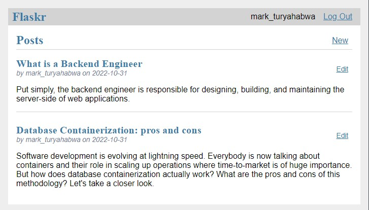
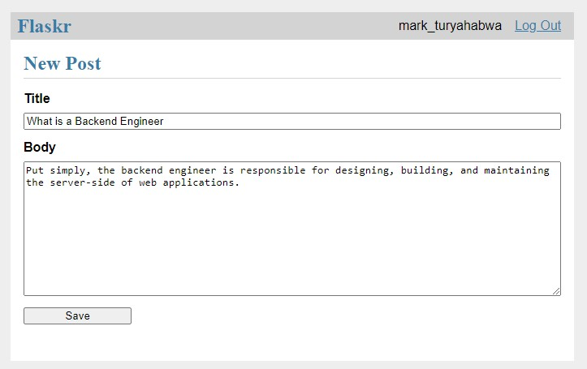

# Flaskr Blog

A blog application done to apply core concepts as learned from the official flask documentation. It involved:

- REST API (Users are able to register, log in, create posts, and edit or delete their own posts.)
- Authentication, registering blueprints, sessions and cookies, protected routes.
- SQLite database for users and posts
- Template views
- Tests
- Deployment or packaging and installing the application on other computers. 

<table border="0">
 <tr>
    <td><b style="font-size:20px">Index</b></td>
    <td><b style="font-size:20px">Create post</b></td>
 </tr>
 <tr>
    <td></td>
    <td></td>
 </tr>
</table>

## Link
You can register and checkout the blog -> [here](https://flaskr-python-app.herokuapp.com/)

## Install the Project
### Use pip to install the project in the virtual environment.
    pip install -e .

## Running the app locally
### Initialise the db
    flask --app flaskr init-db
### then run
    flask --app flaskr run

## Tests
### Install pytest and coverage then:
    coverage run -m pytest && coverage report

